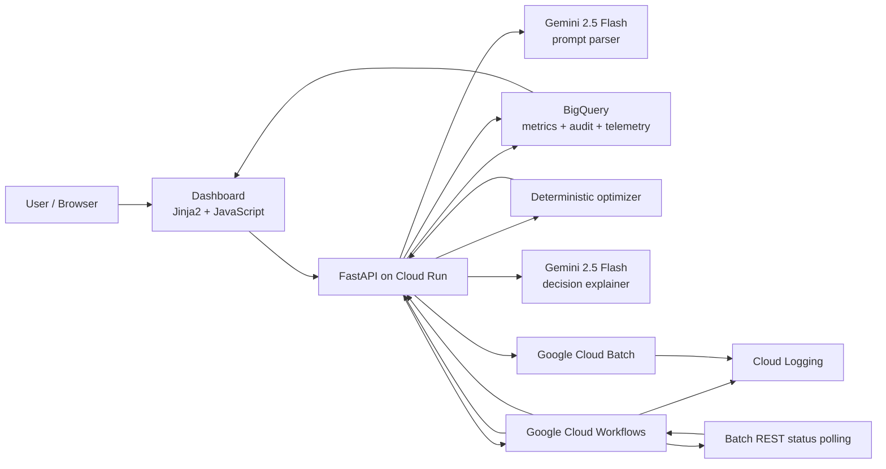
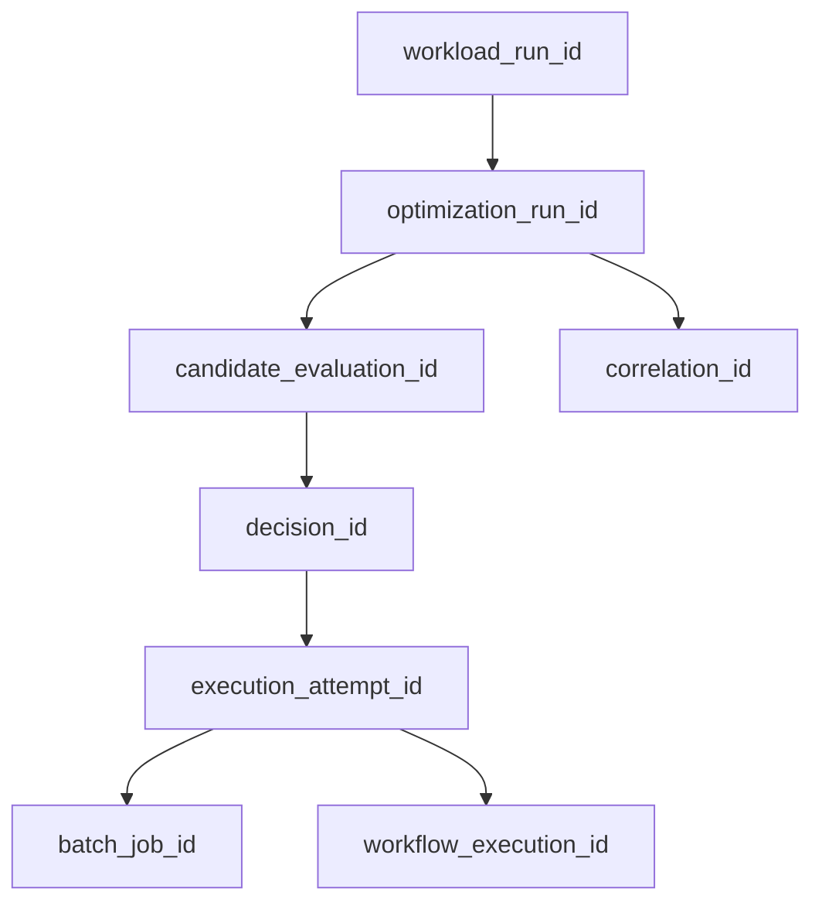

# GreenCompute AI — Project and Implementation Guide

**Document status:** Current implementation reference

**Last verified against repository:** 10 September 2026

**Application version:** `0.5.0`

**Primary Google Cloud project:** `greencompute-ai`

**Primary deployment region:** `asia-south1`

---

## 1. Purpose of this document

This document is the single implementation reference for GreenCompute AI. It explains:

- the problem the product solves;
- which workloads it is designed for;
- the current end-to-end architecture;
- every application component and its responsibility;
- the optimizer's hard constraints and scoring rules;
- the BigQuery datasets, tables, views, and data flow;
- the Gemini, Cloud Run, Workflows, and Cloud Batch integration;
- local setup, Google Cloud deployment, testing, and verification;
- operational troubleshooting and known failure modes;
- what is implemented today and what remains on the roadmap.

Statements marked **Implemented** describe code that exists in this repository. Statements marked **Planned** or **Production hardening** must not be presented as live functionality.

---

## 2. Project in simple language

GreenCompute AI chooses **where**, **when**, and **on which type of compute capacity** a movable batch job should run.

A user can write a request such as:

> Run a checkpointable Monte Carlo simulation before tomorrow at 12:00 UTC. The data is portable, it needs 4 vCPUs and 16 GB memory, and Spot instances are allowed. Prioritize carbon reduction but do not pay more than 10% extra.

The system then:

1. uses Gemini to convert the request into a validated workload specification;
2. reads price, carbon, reliability, and capacity observations from BigQuery;
3. creates possible combinations of region, machine, provisioning model, and start time;
4. rejects combinations that violate hard business or technical rules;
5. scores the remaining candidates using explicit objective weights;
6. returns a traceable decision and a human-readable explanation;
7. optionally sends the selected plan through Google Cloud Workflows;
8. submits the job to Google Cloud Batch in the selected region;
9. records submission and final execution telemetry in BigQuery;
10. shows the decision, Workflow status, Batch outcome, runtime, and cost in the dashboard.

The important design principle is:

> Gemini understands and explains intent, but deterministic code enforces rules and selects the execution plan.

The large language model is not allowed to silently bypass region, data-residency, deadline, resource, Spot, reliability, or cost guardrails.

---

## 3. The real problem GreenCompute AI solves

Cloud batch jobs are commonly submitted with a static region, fixed start time, and fixed capacity type. That is simple, but it can miss opportunities caused by differences in:

- regional grid carbon intensity;
- regional compute price;
- Standard versus Spot price and interruption risk;
- temporary capacity availability;
- workload deadlines and available scheduling slack;
- data-residency and data-locality constraints.

GreenCompute AI turns these trade-offs into an auditable placement decision. It is most useful for **compute-heavy, delay-tolerant, and movable workloads**, including:

- Monte Carlo financial or risk simulations;
- parameter sweeps and scientific simulations;
- model training and hyperparameter searches where the training data is replicated or portable;
- media rendering, transcoding, and synthetic media generation;
- software builds, test matrices, fuzzing, and security scans;
- protein folding, weather, engineering, or optimization simulations;
- synthetic-data generation;
- batch inference over compact or replicated inputs;
- map-reduce style processing where compute dominates the transferred input size;
- disaster-recovery drills or capacity-overflow workloads;
- jobs already packaged in a portable container with input in multi-region or replicated storage.

It is usually **not** a good fit for:

- latency-sensitive online requests;
- stateful databases;
- jobs tied to specialized hardware available in only one location;
- non-checkpointable Spot jobs with a tight deadline;
- data-heavy jobs where moving the input costs more than the compute or carbon benefit;
- workloads prohibited from leaving their data-residency boundary.

GreenCompute AI does not assume that cross-region movement is always desirable. For `DATA_LOCAL` workloads it locks execution to the home region. For replicated data it permits only regions with approved replicas. For portable, compute-heavy workloads it can compare multiple allowed regions.

---

## 4. Current architecture



### 4.1 Current Google Cloud resources

| Resource | Current value | Purpose |
|---|---|---|
| Google Cloud project ID | `greencompute-ai` | Resource and billing boundary |
| Google Cloud project number | `877509863043` | Appears in generated resource URLs |
| Cloud Run service | `greencompute-api` | Hosts the API and dashboard |
| Cloud Run region | `asia-south1` | Primary application region |
| Cloud Run URL | `https://greencompute-api-877509863043.asia-south1.run.app` | Current public application endpoint |
| Workflow | `greencompute-orchestrator` | Coordinates optimization, scheduling, Batch, and callback |
| Workflow location | `asia-south1` | Workflow deployment location |
| Batch job region | Selected per candidate | Actual execution placement |
| Gemini model | `gemini-2.5-flash` | Prompt parsing and explanation |
| Vertex AI location | `us-central1` | Current Gemini client location |
| BigQuery location | `asia-south1` | Stores configuration snapshots, observations, events, and views |

The Cloud Run service is currently deployed with `--allow-unauthenticated` for the demonstration. Private service-to-service authentication is a production-hardening item.

---

## 5. End-to-end request lifecycle

### 5.1 Evaluate-only flow

1. The user enters natural language in the dashboard and clicks **Evaluate & Explain Plan**.
2. The browser calls `POST /api/v1/workloads/from-prompt?dispatch=false`.
3. `PromptParser` calls Gemini and requests a JSON workload specification.
4. Pydantic validates the parsed specification.
5. If runtime was omitted, the API looks up historical successful executions and uses a conservative p90 duration. It falls back to planned history and then 60 minutes.
6. The API reads current compute options from `greencompute_analytics.v_current_compute_options`.
7. The deterministic optimizer creates, validates, and scores candidates.
8. The full optimization run, candidate set, policy evidence, selected decision, and retained alternatives are inserted into BigQuery.
9. Gemini produces a concise explanation of the already-selected deterministic result.
10. The API returns the parsed specification, optimization result, candidate evidence, and explanation.
11. The dashboard shows the selected region, machine, provisioning model, carbon baseline, estimated cost, objective weights, scheduled start, SLA buffer, and a diverse candidate comparison.

### 5.2 Live dispatch flow

1. The user clicks **Dispatch Live Workflow**.
2. The same parsing and initial optimization flow runs for immediate UI feedback.
3. When no feasible candidate exists, the API returns the optimization evidence as a valid business result and does not create a Workflow execution.
4. `WorkflowExecutionAdapter` starts `greencompute-orchestrator` with:

   ```json
   {
     "api_base_url": "https://greencompute-api-877509863043.asia-south1.run.app",
     "workload": { "...": "validated OptimizeRequest" }
   }
   ```

5. The Workflow calls `/api/v1/optimize` to obtain the execution candidate.
6. If `scheduled_start_at` is in the future, the Workflow suspends with `sys.sleep_until`.
7. The Workflow calls `/api/v1/execute`.
8. The API submits the configured job to Cloud Batch and writes a `BATCH_SUBMITTED` event.
9. The Workflow writes a `WORKFLOW_DISPATCHED` link event immediately, before polling.
10. The Workflow polls the Batch REST API every 5 seconds, for at most 40 retries.
11. When Batch reaches a terminal state, the Workflow calculates elapsed time and actual compute cost.
12. The Workflow calls `/api/v1/execution-callback`; the callback uses retry semantics.
13. The API records a deterministic terminal event such as `BATCH_SUCCEEDED` or `BATCH_FAILED`.
14. The Workflow requests the Gemini explanation and returns its result.
15. The dashboard polls Workflow state every 3.5 seconds and BigQuery telemetry every 10 seconds.

### 5.3 Important state distinction

Workflow state and Batch state are related but not identical:

- Workflow `SUCCEEDED` means the orchestration definition completed successfully.
- Batch `SUCCEEDED` means the compute job completed successfully.
- A Batch failure can be recorded even if the Workflow itself successfully completed its failure-handling path.
- A Workflow can fail after Batch succeeds if a callback, API, permission, or explanation step fails.

The execution ledger is therefore the authoritative source for Batch outcome; the Workflow details are the source for orchestration diagnostics.

---

## 6. Repository structure

```text
greencompute-ai-github/
├── app/
│   ├── api/routers/
│   │   ├── execution.py       # Batch dispatch, Workflow link, final callback
│   │   ├── optimization.py    # Optimize, explain, prompt-ingestion endpoints
│   │   ├── telemetry.py       # BigQuery telemetry API
│   │   ├── views.py           # Dashboard route
│   │   └── workflows.py       # Workflow execution-details API
│   ├── static/js/dashboard.js # Browser behavior and polling
│   ├── templates/index.html   # Dashboard UI
│   ├── batch_client.py        # Cloud Batch and execution-event adapter
│   ├── bigquery_client.py     # Compute-option reads and decision persistence
│   ├── dependencies.py       # Shared application clients
│   ├── explainer.py          # Gemini decision explanation
│   ├── main.py               # FastAPI application entrypoint
│   ├── models.py             # Validated API and domain models
│   ├── optimizer.py          # Deterministic optimizer
│   ├── prompt_parser.py      # Gemini natural-language parser
│   └── workflow_client.py    # Workflow execution client
├── database/bigquery/        # Modern scalable BigQuery DDL, views, and seeds
├── docs/
│   ├── data-layer.md
│   └── PROJECT_IMPLEMENTATION_GUIDE.md
├── scripts/
│   └── refresh_gcp_prices.py # Public Cloud Billing price refresh
├── sql/                      # Original six-table prototype; retained as legacy
├── tests/
│   └── test_optimizer.py
├── workflows/
│   └── orchestration.yaml
├── Dockerfile
└── requirements.txt
```

The `database/bigquery/` design is the current data architecture. The three files in `sql/` represent the earlier single-dataset prototype and should not be used as the authoritative production model.

---

## 7. API contracts

### 7.1 Endpoints

| Method | Path | Responsibility |
|---|---|---|
| `GET` | `/` | Serve the dashboard |
| `GET` | `/health` | Health check |
| `POST` | `/api/v1/optimize` | Run deterministic optimization and persist evidence |
| `POST` | `/api/v1/explain` | Generate a Gemini explanation for a selected candidate |
| `POST` | `/api/v1/workloads/from-prompt` | Parse natural language; optionally optimize and dispatch |
| `POST` | `/api/v1/execute` | Submit the selected candidate to Cloud Batch |
| `POST` | `/api/v1/execution-workflow-link` | Attach Workflow execution ID to the Batch attempt |
| `POST` | `/api/v1/execution-callback` | Persist terminal Batch state, duration, and cost |
| `GET` | `/api/v1/workflows/status/{execution_id}` | Return the live Workflow execution record |
| `GET` | `/api/v1/telemetry` | Return the latest 10 execution summaries |

FastAPI also exposes generated API documentation at `/docs` and `/redoc` unless disabled by deployment configuration.

### 7.2 Core optimization request

```json
{
  "workload_name": "Monte Carlo portfolio risk simulation",
  "workload_id": "wr_portfolio_monte_carlo",
  "policy_version_id": "pol_v1_default",
  "estimated_runtime_minutes": 60,
  "earliest_start_at": "2026-09-10T20:00:00Z",
  "deadline_at": "2026-09-11T06:00:00Z",
  "start_mode": "FLEXIBLE",
  "data_location_type": "PORTABLE",
  "home_region": "asia-south1",
  "approved_replica_regions": [],
  "allowed_regions": ["asia-south1", "europe-west1"],
  "required_vcpus": 4,
  "required_memory_gb": 16,
  "spot_allowed": true,
  "checkpointable": true,
  "minimum_reliability_score": 0.8,
  "minimum_sla_buffer_minutes": 30,
  "maximum_cost_increase_percent": 10,
  "objective_weights": {
    "cost": 0.25,
    "carbon": 0.55,
    "reliability": 0.15,
    "sla_buffer": 0.05
  },
  "region_metrics": []
}
```

`region_metrics` is optional. When empty, the API reads BigQuery. Supplying it is useful for deterministic tests and simulations.

### 7.3 Validation rules

- `workload_name` must contain 1–200 characters.
- runtime, vCPU, and memory must be greater than zero.
- reliability must be between 0 and 1.
- cost premium must be non-negative when supplied.
- timestamps must include a timezone.
- the deadline must be later than the earliest start.
- objective weights must each be between 0 and 1 and must add to exactly 1 within a tolerance of `0.00001`.
- enumerations are restricted to known values:
  - provisioning: `STANDARD`, `SPOT`;
  - start mode: `EXACT`, `FLEXIBLE`;
  - locality: `DATA_LOCAL`, `REPLICATED`, `PORTABLE`.

### 7.4 Optimization response

The response contains:

- `optimization_run_id`: trace ID for one optimizer invocation;
- `decision_id`: stable ID connecting the selected plan to execution telemetry;
- workload and start mode;
- total and feasible candidate counts;
- `selected_candidate`, or `null` if execution is prevented;
- deterministic decision message;
- transparency notice;
- top candidate evidence returned to the UI.

All candidates are persisted in BigQuery. The API returns a compact set of up to eight distinct evidence rows to the browser, prioritizing the selected candidate and avoiding repeated-looking hourly candidates with the same configuration and outcome.

---

## 8. Natural-language processing with Gemini

### 8.1 What Gemini does

Gemini 2.5 Flash performs two bounded functions:

1. **Parsing:** converts the user's natural-language request into JSON matching `OptimizeRequest`.
2. **Explaining:** describes why the deterministic winner was selected and how alternatives compared.

### 8.2 What Gemini does not do

Gemini does not directly submit jobs, select arbitrary regions, edit policies, or override the optimizer. Pydantic rejects structurally invalid output, and the optimizer rechecks all hard constraints.

### 8.3 Parser defaults

When the user omits fields, the parser currently uses:

| Field | Default |
|---|---|
| vCPU | `4` |
| Memory | `16 GB` |
| Home region | `asia-south1` |
| Portable allowed regions | `asia-south1`, `europe-west1` |
| Earliest start | Current UTC time |
| Minimum SLA buffer | `30 minutes` |
| Reliability | Model-derived, with API default `0.85` |
| Objective weights | Cost `.45`, carbon `.25`, reliability `.25`, SLA `.05` |
| Runtime | historical p90, planned average, then `60 minutes` |

An exact user start time sets `start_mode=EXACT`. Otherwise scheduling is flexible. The parser preserves named regions and explicit data-location, Spot, checkpointing, reliability, premium, and weighting requirements.

### 8.4 Historical runtime adaptation

When the prompt omits runtime:

1. query successful records from `v_execution_summary`;
2. match by a simple workload-name slug;
3. compute `APPROX_QUANTILES(...)[OFFSET(90)]`;
4. round up to minutes, with a minimum of 5 minutes;
5. if unavailable, average planned durations from `v_optimization_summary`;
6. finally fall back to 60 minutes.

This is the current closed-loop learning mechanism. It is statistical adaptation, not a trained runtime-prediction model.

---

## 9. Deterministic optimizer

### 9.1 Candidate generation

A candidate is one combination of:

- region;
- machine type;
- provisioning model;
- scheduled start time;
- predicted finish time;
- estimated compute cost;
- carbon-intensity baseline;
- reliability score;
- SLA buffer.

For `EXACT`, the optimizer creates candidates only at `earliest_start_at`. For `FLEXIBLE`, it creates hourly start points from `earliest_start_at` up to:

```text
deadline - estimated runtime - minimum SLA buffer
```

### 9.2 Data-locality behavior

| Locality | Regions considered |
|---|---|
| `DATA_LOCAL` | Home region only |
| `REPLICATED` | Home region plus approved replica regions, intersected with allowed regions |
| `PORTABLE` | Allowed regions; home region if the list is empty |

This prevents the optimizer from treating all workloads as freely movable.

### 9.3 Hard constraints and rejection codes

Candidates are rejected before scoring when they violate a hard rule.

| Rejection | Meaning |
|---|---|
| `REGION_NOT_ALLOWED` | Region conflicts with locality or allowed-region policy |
| `INSUFFICIENT_VCPUS` | Machine has fewer vCPUs than requested |
| `INSUFFICIENT_MEMORY` | Machine has less memory than requested |
| `DOMINATED_RESOURCE_CONFIGURATION` | A smaller shape satisfies the request at equal or lower modeled cost |
| `CAPACITY_UNAVAILABLE` | Current observation marks capacity unavailable |
| `SPOT_NOT_ALLOWED` | Workload/policy does not permit Spot |
| `SPOT_REQUIRES_CHECKPOINTABLE_WORKLOAD` | Spot requested for a job that cannot safely resume |
| `DEADLINE_MISSED` | Predicted finish is after deadline |
| `SLA_BUFFER_BELOW_POLICY_THRESHOLD` | Remaining deadline buffer is too small |
| `RELIABILITY_BELOW_POLICY_THRESHOLD` | Observed reliability is below the minimum |
| `COST_INCREASE_ABOVE_POLICY_THRESHOLD` | Candidate exceeds the permitted premium over the cheapest initially feasible plan |

If every candidate is rejected, `selected_candidate` is `null` and dispatch is prevented.

### 9.4 Cost calculation

Current compute cost is:

```text
estimated_compute_cost = hourly_price × estimated_runtime_minutes / 60
```

The optimizer preserves nine decimal places because the demo jobs can run for seconds and produce very small costs. The Batch callback also converts floating-point cost into a decimal string with at most nine decimal places before inserting into BigQuery `NUMERIC`.

### 9.5 Weighted scoring

Only feasible candidates are scored. Each metric is normalized to a `0..1` benefit range among feasible candidates:

```text
lower-is-better(x)  = (maximum - x) / (maximum - minimum)
higher-is-better(x) = (x - minimum) / (maximum - minimum)
```

If all values for a metric are equal, every candidate receives `1.0` for that metric.

Final score:

```text
score =
    cost_weight        × normalized_low_cost
  + carbon_weight      × normalized_low_carbon
  + reliability_weight × normalized_high_reliability
  + sla_buffer_weight  × normalized_high_sla_buffer
```

Candidates are ordered by:

1. higher final score;
2. lower estimated compute cost;
3. lower carbon score;
4. higher reliability;
5. higher SLA buffer.

This makes results repeatable for the same input and metric snapshot, apart from generated identifiers and timestamps.

Before normalization, the optimizer removes dominated oversized shapes within the same region, provisioning model, and start time. Because runtime is not yet machine-performance-aware, an oversized and more expensive shape has no modeled benefit. Removing it prevents an extreme high price from compressing the cost differences between right-sized Standard and Spot candidates.

### 9.6 Decision evidence

Each optimization persists:

- the optimization header and exact input snapshot;
- every evaluated candidate, including rejected candidates;
- exact rejection reasons;
- per-candidate policy evidence;
- the selected decision;
- retained `CHEAPEST`, `GREENEST`, and `SAFEST` feasible alternatives;
- the final score and configured objective weights.

The retained alternatives can refer to the same candidate when one option is simultaneously cheapest, greenest, or safest. They are decision roles, not necessarily distinct physical candidates.

---

## 10. Data layer

### 10.1 Why BigQuery is used

BigQuery is the analytical and event store. It is appropriate for:

- append-oriented observation history;
- large candidate and policy audit trails;
- time-series price/carbon/reliability/capacity data;
- execution telemetry;
- aggregate reporting and FinOps analysis;
- comparing estimated and actual outcomes.

BigQuery is not being used as a high-frequency transactional application database. PostgreSQL was considered for a future operational control plane but is **not used by the current application**.

### 10.2 Dataset separation

| Dataset | Responsibility |
|---|---|
| `greencompute_config` | Immutable/versioned workload, policy, data-asset, region, machine, and SKU configuration |
| `greencompute_metrics` | Time-series price, carbon, reliability, capacity, and transfer observations |
| `greencompute_events` | Workload, optimization, candidate, policy, decision, and execution events |
| `greencompute_audit` | Security/user-action and data-quality audit events |
| `greencompute_analytics` | Query-friendly views for the API, dashboard, and reporting |
| `greencompute` | Legacy prototype dataset; not the modern source of truth |

All current datasets are intended to be created in `asia-south1` to avoid BigQuery cross-location query restrictions.

### 10.3 Configuration tables

#### `greencompute_config.workload_definition_versions`

Versioned workload definitions: organization/team ownership, workload type, expected resources and runtime, Spot/checkpoint behavior, allowed regions, residency rule, and baseline profile.

#### `greencompute_config.policy_versions`

Versioned company guardrails: allowed regions, minimum reliability, maximum sustainability premium, Spot permission, lower-carbon preference, fallback profile, and extensible JSON rules.

#### `greencompute_config.data_asset_versions`

Versioned data-location metadata: classification, residency regions, source region, transfer permission, and transfer constraints.

#### `greencompute_config.cloud_region_catalog`

Supported cloud regions, country/metro mapping, and approximate coordinates for carbon-provider lookup. Coordinates describe metro approximations, not physical Google data-center coordinates.

#### `greencompute_config.machine_profiles`

Machine shape inventory: series, vCPU, memory, OS, Spot support, and price calculation method.

#### `greencompute_config.pricing_sku_mappings`

Maps region, machine type, provisioning model, and CPU/memory components to Cloud Billing SKU IDs.

### 10.4 Metric tables

#### `greencompute_metrics.price_observations`

Time-stamped compute prices with currency, unit, source, synthetic flag, optional SKU data, and raw source payload.

#### `greencompute_metrics.carbon_observations`

Regional carbon scores/intensity values, unit, confidence, source, version, timestamp, raw payload, and mandatory synthetic-data disclosure.

#### `greencompute_metrics.reliability_observations`

Reliability and interruption-risk observations by region, machine, and provisioning model.

#### `greencompute_metrics.capacity_observations`

Capacity availability/score, with extension fields for zone, requested VM count, obtainability, and estimated uptime.

#### `greencompute_metrics.data_transfer_observations`

Source-to-destination transfer cost and time observations. The table exists, but transfer cost is not yet included in optimizer feasibility or final scoring.

### 10.5 Event tables

#### `greencompute_events.workload_run_events`

Immutable workload lifecycle events with policy version, timestamps, actor, correlation, and payload.

#### `greencompute_events.optimization_runs`

One header per optimizer invocation, including optimizer version, objective configuration, metric references, full input snapshot, and status.

#### `greencompute_events.candidate_evaluations`

One row per region/machine/provisioning/start-time candidate, including costs, carbon, reliability, capacity, SLA, feasibility, rejection reasons, rank, and final score.

#### `greencompute_events.policy_evaluations`

Per-candidate rule results. Rejected candidates have one row per rejection reason; candidates that pass receive an `ALL_HARD_CONSTRAINTS` record.

#### `greencompute_events.optimization_decisions`

Selected and alternative decision roles, explanation, fallback candidate reference, outcome metrics, and timestamp.

#### `greencompute_events.execution_events`

Append-only execution ledger connecting workload, decision, execution attempt, Workflow, Batch job, state, region, actual runtime, actual cost, errors, and correlation ID.

### 10.6 Audit tables

- `greencompute_audit.audit_events`: actor/action/outcome evidence and resource metadata.
- `greencompute_audit.data_quality_events`: detected quality problems and their resolution lifecycle.

The schemas exist. The current API does not yet write every user/API action into `audit_events`, nor automatically store data-quality check results in `data_quality_events`.

### 10.7 Analytical views

| View | Purpose |
|---|---|
| `v_current_compute_options` | Joins the latest eligible price, carbon, capacity, reliability, machine, and region records |
| `v_optimization_summary` | One query-friendly selected outcome per optimization run |
| `v_candidate_comparison` | Candidate evidence, final score, decision role, and selection state |
| `v_execution_summary` | Latest event per execution attempt, with Workflow ID recovered from any event in the attempt |
| `v_daily_decision_metrics` | Daily decision count, selected cost, average carbon/reliability, and fallback count |

`v_execution_summary` deliberately selects the latest execution event while separately recovering `workflow_execution_id` from the full event chain. This prevents the Workflow column from becoming empty when the terminal event lacks or overwrites earlier details.

### 10.8 Current metric truth level

| Metric | Current source | Truth level |
|---|---|---|
| Price | Cloud Billing API snapshot through `refresh_gcp_prices.py` | Real public list-price input when refresh is configured |
| Carbon | Static regional baseline | Synthetic, comparative only |
| Reliability | Static Standard/Spot baseline | Synthetic estimate |
| Capacity | Static availability baseline | Synthetic estimate |
| Runtime | Actual Batch event history when available | Empirical |
| Actual cost | Runtime × selected hourly rate | Calculated estimate, not reconciled billing cost |

The UI and optimizer transparency message must not describe static carbon values as live Google data-center emissions.

### 10.9 Supported region catalog

The region catalog currently seeds:

- `asia-south1` — Mumbai;
- `asia-south2` — Delhi;
- `asia-southeast1` — Singapore;
- `asia-southeast2` — Jakarta;
- `asia-northeast1` — Tokyo;
- `asia-northeast2` — Osaka;
- `australia-southeast1` — Sydney;
- `us-central1` — Iowa;
- `us-east4` — Northern Virginia;
- `europe-west1` — Belgium.

A region appears in `v_current_compute_options` only when matching current price, carbon, reliability, capacity, machine-profile, and active-region records all exist.

---

## 11. Price ingestion

`scripts/refresh_gcp_prices.py`:

1. reads active region/machine/provisioning/component SKU mappings from BigQuery;
2. reads `greencompute-pricing-api-key` from Secret Manager;
3. calls the Cloud Billing SKU price endpoint;
4. caches component prices per SKU;
5. calculates machine hourly price as:

   ```text
   vCPU count × CPU hourly price
   + memory GB × memory hourly price
   ```

6. writes newline-delimited JSON to `tmp/current_machine_prices.ndjson`;
7. loads rows into `greencompute_metrics.price_observations`.

The script currently contains project/location/secret/output constants. Moving them to command-line flags or environment variables is a production-hardening task.

Run from the repository root:

```bash
python3 scripts/refresh_gcp_prices.py
```

The local `tmp/` directory must exist, the caller must have permission to access the secret and BigQuery, and `gcloud` plus `bq` must be installed and authenticated.

---

## 12. Cloud Batch implementation

The current Batch adapter submits a real Google Cloud Batch job. The runnable is a small demonstration script that:

- prints selected placement information;
- calculates a Monte Carlo estimate of pi with one million samples;
- logs completion.

Batch configuration includes:

- one task group;
- one task;
- `max_retry_count=1`;
- the optimizer-selected machine type;
- `SPOT` or `STANDARD` provisioning;
- allowed location restricted to `regions/{selected_region}`;
- Cloud Logging destination.

The returned fully qualified Batch job name is stored in the execution ledger.

This proves that the optimizer's selection controls real regional compute placement. Replacing the demonstration runnable with a user-supplied container/image and arguments is still planned.

---

## 13. Workflow implementation

`workflows/orchestration.yaml` is the long-running orchestration layer.

Its main responsibilities are:

1. receive the validated workload and API base URL;
2. call the optimizer;
3. honor future scheduling with `sys.sleep_until`;
4. dispatch the selected plan to Batch through the API;
5. store the Workflow-to-Batch linkage;
6. poll Batch through an OAuth2-authenticated Google API call;
7. enforce a bounded polling loop;
8. calculate actual duration and cost;
9. send a retryable terminal callback;
10. request the Gemini explanation;
11. return final orchestration details.

Terminal Batch states currently recognized by the Workflow are `SUCCEEDED`, `FAILED`, and `DELETION_IN_PROGRESS`. Timeout is represented as failed. The API callback also accepts `CANCELLED` and maps deletion-in-progress to failed.

The callback uses a deterministic event ID based on execution attempt and terminal status. BigQuery insert IDs provide best-effort immediate retry de-duplication.

---

## 14. Dashboard implementation

The dashboard is server-rendered HTML with Tailwind loaded from CDN and plain browser JavaScript.

Current capabilities:

- natural-language workload input;
- separate evaluate and dispatch buttons;
- selected region, instance, provisioning, carbon, and cost cards;
- configured objective-weight display;
- deterministic candidate-evidence table;
- scheduled-start and SLA-buffer evidence columns;
- Gemini trade-off explanation;
- live Workflow status and elapsed timer;
- direct Cloud Logging link;
- full-width empirical telemetry table;
- latest execution state, runtime, and actual cost;
- Workflow details modal;
- raw execution JSON modal;
- automatic Workflow and telemetry polling;
- stale decision UI reset before each new request;
- stale Workflow details hidden before each new request;
- no fake region/cost fallback when an API value is missing;
- explicit no-feasible-plan state returned as a valid business result without starting a Workflow.

The telemetry section is outside the two-column input/result grid so that workload ID, region, status, runtime, cost, Workflow controls, and JSON controls fit at normal desktop widths. It remains horizontally scrollable on smaller screens.

---

## 15. Local development

### 15.1 Prerequisites

- Python 3.12 is the container baseline;
- a Google Cloud project and Application Default Credentials for cloud-backed calls;
- access to BigQuery, Vertex AI, Workflows, and Batch;
- `gcloud` and `bq` for setup/deployment.

### 15.2 Create a virtual environment

macOS/Linux:

```bash
python3 -m venv .venv
source .venv/bin/activate
python -m pip install --upgrade pip
python -m pip install -r requirements.txt
```

If `pip` is forced to use an unavailable corporate Artifactory index, override it for this environment:

```bash
python -m pip install --index-url https://pypi.org/simple -r requirements.txt
```

The earlier error `No matching distribution found for fastapi` was caused by the configured package index being unreachable, not by the FastAPI version constraint.

### 15.3 Authentication

For local calls to Google Cloud client libraries:

```bash
gcloud auth application-default login
gcloud config set project greencompute-ai
```

### 15.4 Run the application

```bash
uvicorn app.main:app --reload --host 127.0.0.1 --port 8080
```

Then open `http://127.0.0.1:8080`.

The application constructs Google Cloud clients at import time. Without valid credentials, even locally serving the dashboard may fail during startup.

### 15.5 Run tests

```bash
pytest -q
```

Current optimizer tests cover:

- data-local cross-region prevention;
- Spot rejection for a non-checkpointable workload;
- cost-only weighted selection;
- carbon-only weighted selection;
- maximum-cost-premium override;
- stable decision ID generation;
- protection against oversized-machine normalization distortion.

---

## 16. BigQuery setup from scratch

### 16.1 Enable the required APIs

```bash
gcloud services enable \
  run.googleapis.com \
  cloudbuild.googleapis.com \
  artifactregistry.googleapis.com \
  bigquery.googleapis.com \
  aiplatform.googleapis.com \
  workflows.googleapis.com \
  workflowexecutions.googleapis.com \
  batch.googleapis.com \
  secretmanager.googleapis.com \
  cloudbilling.googleapis.com \
  --project=greencompute-ai
```

### 16.2 Create the datasets

```bash
bq --location=asia-south1 mk --dataset greencompute-ai:greencompute_config
bq --location=asia-south1 mk --dataset greencompute-ai:greencompute_metrics
bq --location=asia-south1 mk --dataset greencompute-ai:greencompute_events
bq --location=asia-south1 mk --dataset greencompute-ai:greencompute_audit
bq --location=asia-south1 mk --dataset greencompute-ai:greencompute_analytics
```

If a dataset already exists, `bq mk` will report that fact; do not delete populated datasets merely to rerun setup.

### 16.3 Apply schemas and views

From the repository root:

```bash
bq --location=asia-south1 query --use_legacy_sql=false < database/bigquery/10_config_tables.sql
bq --location=asia-south1 query --use_legacy_sql=false < database/bigquery/20_metrics_tables.sql
bq --location=asia-south1 query --use_legacy_sql=false < database/bigquery/30_event_tables.sql
bq --location=asia-south1 query --use_legacy_sql=false < database/bigquery/40_audit_tables.sql
bq --location=asia-south1 query --use_legacy_sql=false < database/bigquery/80_extend_real_metric_fields.sql
bq --location=asia-south1 query --use_legacy_sql=false < database/bigquery/81_region_catalog.sql
bq --location=asia-south1 query --use_legacy_sql=false < database/bigquery/83_machine_profiles.sql
bq --location=asia-south1 query --use_legacy_sql=false < database/bigquery/84_pricing_sku_mappings.sql
bq --location=asia-south1 query --use_legacy_sql=false < database/bigquery/85_add_machine_profiles.sql
bq --location=asia-south1 query --use_legacy_sql=false < database/bigquery/86_deduplicate_pricing_sku_mappings.sql
bq --location=asia-south1 query --use_legacy_sql=false < database/bigquery/89_add_candidate_final_score.sql
```

The shell `<` operator sends the contents of the SQL file to the `bq query` command. The SQL is executed in Standard SQL mode in `asia-south1`.

### 16.4 Load reference observations

For the current real-price/static-other-metrics path:

```bash
bq --location=asia-south1 query --use_legacy_sql=false < database/bigquery/82_seed_static_carbon_baselines.sql
python3 scripts/refresh_gcp_prices.py
bq --location=asia-south1 query --use_legacy_sql=false < database/bigquery/87_seed_static_capacity_reliability.sql
bq --location=asia-south1 query --use_legacy_sql=false < database/bigquery/88_current_compute_options_view.sql
bq --location=asia-south1 query --use_legacy_sql=false < database/bigquery/50_analytics_views.sql
```

Files `60_seed_config.sql`, `61_seed_metrics.sql`, and `62_seed_events.sql` are demonstration seed data. They contain plain `INSERT` statements and can create duplicates if rerun. Use them only when a demo dataset needs those example records.

### 16.5 Run quality checks

```bash
bq --location=asia-south1 query --use_legacy_sql=false < database/bigquery/70_data_quality_checks.sql
```

Every returned row should show `status=PASS` and `violation_count=0`. Checks currently verify:

- selected decisions reference feasible candidates;
- decision costs have currency;
- candidates reference optimization runs;
- policy evaluations reference candidates;
- synthetic carbon records name a source;
- workload run events reference a policy version.

---

## 17. Cloud deployment

### 17.1 Environment variables

| Variable | Default/current value | Used by |
|---|---|---|
| `GOOGLE_CLOUD_PROJECT` | `greencompute-ai` | all Google clients |
| `WORKFLOW_LOCATION` | `asia-south1` | Workflow client |
| `WORKFLOW_NAME` | `greencompute-orchestrator` | Workflow client |
| `API_BASE_URL` | current Cloud Run URL | Workflow trigger payload |
| `PORT` | `8080` | container runtime |

### 17.2 Deploy Cloud Run

```bash
gcloud run deploy greencompute-api \
  --source . \
  --region asia-south1 \
  --project greencompute-ai \
  --set-env-vars API_BASE_URL=https://greencompute-api-877509863043.asia-south1.run.app,WORKFLOW_LOCATION=asia-south1,WORKFLOW_NAME=greencompute-orchestrator \
  --allow-unauthenticated
```

The Docker image uses Python 3.12 slim, installs `requirements.txt`, copies `app/`, and starts Uvicorn on port 8080.

### 17.3 Deploy the Workflow

```bash
gcloud workflows deploy greencompute-orchestrator \
  --source=workflows/orchestration.yaml \
  --location=asia-south1 \
  --project=greencompute-ai
```

Deploy Cloud Run and Workflow as separate commands so a failure in one is not mistaken for success in the other.

### 17.4 IAM responsibilities

Use dedicated service accounts in production. At minimum, the effective identities need narrowly scoped permissions for:

- Cloud Run runtime: run BigQuery query jobs, read metric/config/view data, write event data, create Workflow executions, create Batch jobs, and use the Batch VM service account when required;
- Workflow runtime: call the Cloud Run API if it is private and read Batch job state;
- price refresher: access the pricing API secret and append price observations;
- Batch VM identity: pull its container/image when used and write logs or access only the workload data it requires.

Do not use broad Owner/Editor roles as a production solution. Exact IAM bindings should be applied to named service accounts and datasets for the deployment environment.

---

## 18. Deployment verification

### 18.1 Basic health

```bash
curl -sS https://greencompute-api-877509863043.asia-south1.run.app/health
```

### 18.2 Current compute options

```bash
bq --location=asia-south1 query --use_legacy_sql=false \
'SELECT region, machine_type, provisioning_model, hourly_price_usd,
        carbon_intensity_gco2e_per_kwh, reliability_score, capacity_available
 FROM `greencompute_analytics.v_current_compute_options`
 ORDER BY region, machine_type, provisioning_model'
```

### 18.3 Candidate evidence

```bash
bq --location=asia-south1 query --use_legacy_sql=false \
'SELECT workload_run_id, region, machine_type, provisioning_model,
        estimated_compute_cost, carbon_score, reliability_score,
        final_score, is_feasible, rejection_reasons, is_selected
 FROM `greencompute_analytics.v_candidate_comparison`
 ORDER BY evaluated_at DESC
 LIMIT 20'
```

If `evaluated_at` is not exposed by the installed view revision, order by `optimization_run_id` or query the underlying candidate table.

### 18.4 Workflow executions

```bash
gcloud workflows executions list greencompute-orchestrator \
  --location=asia-south1 \
  --limit=20 \
  --format='table(name,state,startTime,endTime)'
```

Describe one execution using its exact final UUID from the list:

```bash
gcloud workflows executions describe EXECUTION_UUID \
  --workflow=greencompute-orchestrator \
  --location=asia-south1 \
  --format=json
```

Copy the ID exactly. A one-character difference returns `NOT_FOUND` even if a visually similar execution exists.

### 18.5 Execution telemetry

```bash
bq --location=asia-south1 query --use_legacy_sql=false \
'SELECT workload_run_id, decision_id, execution_attempt_id, batch_job_id,
        region, execution_status, latest_status_at, actual_runtime_seconds,
        actual_cost, workflow_execution_id
 FROM `greencompute_analytics.v_execution_summary`
 ORDER BY latest_status_at DESC
 LIMIT 20'
```

### 18.6 API telemetry

```bash
curl -sS https://greencompute-api-877509863043.asia-south1.run.app/api/v1/telemetry
```

---

## 19. Test prompts

### Portable, carbon-prioritized

```text
Run a checkpointable Monte Carlo portfolio simulation before tomorrow at 10:00 UTC. The input is portable. It needs 4 vCPUs and 16 GB memory, may run in asia-south1 or europe-west1, and Spot is allowed. Weight carbon at 0.60, cost at 0.20, reliability at 0.15, and SLA buffer at 0.05.
```

### Data-local

```text
Run a 60-minute customer analytics job before tomorrow at 08:00 UTC. The data must remain in its home region asia-south1. It needs 4 vCPUs and 16 GB memory. Use Standard capacity and require reliability of at least 0.95.
```

Expected property: no cross-region candidate can be selected.

### Replicated data

```text
Run a checkpointable batch inference job for 45 minutes before tomorrow at 06:00 UTC. The data has approved replicas in asia-south1 and europe-west1. Both regions are allowed. It needs 4 vCPUs and 16 GB memory and Spot is permitted.
```

### Exact user-selected start time

```text
Start a portable checkpointable risk simulation at exactly 23:00 UTC today and finish before 02:00 UTC tomorrow. It needs 4 vCPUs and 16 GB memory, can run in asia-south1 or europe-west1, and Spot is allowed.
```

Expected property: the optimizer respects the exact requested time. GreenCompute may still choose the region and provisioning model within the user's other constraints.

### Reliability blocks Spot

```text
Run a checkpointable portable simulation before tomorrow at noon UTC. It needs 4 vCPUs and 16 GB memory. Spot is allowed, but reliability must be at least 0.98. Allow asia-south1 and europe-west1.
```

Expected property: a static Spot reliability of `0.85` is rejected.

### Carbon preference constrained by cost guardrail

```text
Run a 60-minute portable checkpointable simulation before tomorrow at noon UTC in asia-south1 or europe-west1. Prioritize carbon reduction, but do not choose any option costing more than 5 percent above the cheapest valid option. Use weights carbon 0.70, cost 0.15, reliability 0.10, SLA buffer 0.05.
```

### Deliberately infeasible

```text
Run a non-checkpointable data-local workload in asia-south1 within 10 minutes. It needs 128 vCPUs and 512 GB memory, Spot only, with reliability of at least 0.999 and a 30-minute safety buffer.
```

Expected property: no feasible plan and no Workflow dispatch.

---

## 20. Troubleshooting

### 20.1 `No matching distribution found for fastapi`

If pip reports an internal Artifactory URL and DNS resolution failures, the index is unreachable. Use an accessible configured corporate network/VPN or explicitly use PyPI for this environment. Do not solve it by changing the valid FastAPI version range.

### 20.2 Workflow deployment reports `unexpected entry 'retry'`

In Google Cloud Workflows YAML, `retry` belongs beside the `try` block for a step, not inside the HTTP call's `args`. The current `notifyCallback` syntax follows this structure:

```yaml
- notifyCallback:
    try:
      call: http.post
      args: {}
      result: callback_result
    retry: ${http.default_retry}
```

### 20.3 Workflow fails at `notifyCallback` with HTTP 503

Inspect Cloud Run logs. A known earlier cause was a BigQuery `NUMERIC` rejection caused by floating-point tails such as:

```text
0.00063066666666666675
```

The current adapter quantizes costs to at most nine decimal places before insertion. Confirm the Cloud Run revision includes that fix.

### 20.4 Telemetry remains `SUBMITTED` after Batch completed

Check, in order:

1. exact Workflow state and error payload;
2. Cloud Run logs for `Failed to record execution event`;
3. terminal rows in `greencompute_events.execution_events`;
4. the installed definition of `v_execution_summary`;
5. whether the dashboard received a non-200 response from `/api/v1/telemetry`.

The telemetry endpoint now returns HTTP 503 on BigQuery failure instead of hiding the error as an empty list.

### 20.5 Workflow column is empty

Confirm that:

- `WORKFLOW_DISPATCHED` exists for the same `execution_attempt_id`;
- the event JSON contains `workflow_execution_id`;
- `v_execution_summary` uses the `workflow_link` CTE from the current `50_analytics_views.sql`;
- the Workflow was redeployed after the link step was added.

### 20.6 Selected region never changes

This is not automatically a fallback bug. Query `v_current_compute_options` and inspect the candidate evidence table. Common reasons are:

- only one allowed region has a complete joined metric row;
- another region is absent from price/capacity/reliability data;
- the request was parsed as `DATA_LOCAL`;
- named regions were not included in `allowed_regions`;
- other candidates fail reliability, resource, Spot, deadline, or premium rules;
- objective weights legitimately keep selecting the same higher-scoring region.

The frontend no longer supplies a fake default selected region. The displayed region comes from `selected_candidate.region`.

### 20.7 Workflow `NOT_FOUND`

First list executions and copy the exact UUID. Also verify project, location, Workflow name, active account, and that the execution belongs to the expected project.

### 20.8 View details shows stale state

The JSON button shows the latest row returned by `v_execution_summary`, not the Workflow API record. Use the Workflow button for current orchestration details. If the event summary is stale, investigate the missing terminal callback rather than changing display text.

---

## 21. Implemented feature inventory

### Implemented

- Modular FastAPI router architecture.
- Cloud Run-hosted dashboard and API.
- Gemini 2.5 Flash natural-language specification parsing.
- Strict Pydantic validation and typed enumerations.
- Historical p90 runtime estimation from successful telemetry.
- BigQuery-driven compute-option discovery.
- Data-local, replicated, and portable region policies.
- Exact and flexible scheduling modes.
- Hourly temporal candidate generation.
- vCPU, memory, capacity, Spot, checkpoint, deadline, SLA, reliability, and cost-premium constraints.
- Normalized multi-objective weighted scoring.
- Deterministic tie-breaking.
- No-feasible-plan dispatch prevention.
- Complete candidate/rejection/decision persistence.
- Selected, cheapest, greenest, and safest decision roles.
- Gemini executive explanation after deterministic selection.
- Real Cloud Workflow dispatch.
- Future scheduled-start suspension.
- Real Cloud Batch submission to the selected region and capacity model.
- Batch status polling and terminal callback.
- Workflow-to-execution telemetry linkage.
- Retry-safe terminal event IDs and BigQuery-safe cost precision.
- Full-width telemetry dashboard with Workflow/log/JSON details.
- Static carbon transparency notice.
- Public Cloud Billing price refresh script.
- Data-quality SQL checks.
- Unit tests for core optimizer behavior.

### Partially implemented

- **Closed-loop adaptation:** runtime history is used; reliability and runtime prediction are not yet workload/machine/region-specific learned models.
- **Data movement:** schema exists, but input size, egress cost, and transfer time do not yet affect candidates.
- **Fallback metadata:** safest candidate is retained, but automatic live failover to Standard capacity is not implemented.
- **Audit:** optimization and execution evidence is extensive, but actor/security audit events are not written for every API action.
- **Cost:** estimated and runtime-derived cost are available; Cloud Billing export reconciliation is not implemented.
- **Carbon:** regional baselines are available; live forecast ingestion and energy-to-CO2 calculation are not implemented.
- **Capacity/reliability:** schemas and static observations exist; live obtainability/interruption signals are not integrated.

### Not implemented yet

- transfer-aware total-cost and transfer-time feasibility;
- input data asset references and size resolution from Cloud Storage/BigQuery metadata;
- automatic Spot preemption detection and Standard fallback;
- dynamic SLA-buffer escalation after retry/preemption;
- general user-supplied container image, command, environment, and data mounts;
- authentication, tenant isolation, user management, and RBAC;
- PostgreSQL operational control plane;
- private Cloud Run service-to-service authentication;
- idempotent workload submission API and durable request state machine;
- Pub/Sub/Eventarc event-driven Batch completion instead of polling;
- live carbon provider ingestion and forecast-based temporal scheduling;
- Cloud Billing export reconciliation for actual billed cost;
- reservations/CUD/SUD/contract price modeling;
- automatic price refresh scheduling and freshness alarms;
- operational metrics, alerts, traces, SLOs, and dead-letter handling;
- automated integration/end-to-end tests in CI/CD;
- policy administration UI and version approval workflow;
- what-if portfolio simulation and executive aggregate reporting;
- multi-cloud execution adapters.

---

## 22. Known limitations and engineering risks

1. **Optimization is currently performed twice for live dispatch.** The API optimizes once for the browser, then the Workflow calls `/optimize` again. Metric changes between calls can produce different decision IDs or selections. The durable design should pass the approved decision ID/candidate into Workflow and validate it before execution.
2. **Carbon values are static.** The system demonstrates the control loop and decision method, not real-time carbon measurement.
3. **Capacity and reliability values are static.** They do not predict actual Spot availability.
4. **Transfer cost is stored but not applied.** Cross-region selections are safe only when the caller correctly declares the workload `PORTABLE` or `REPLICATED`.
5. **Current Batch work is a demo script.** Arbitrary production jobs cannot yet be registered and executed.
6. **Public API exposure is demo-oriented.** There is no user authentication, rate limiting, or organization isolation.
7. **Some identifiers are demo constants.** `org-retail-demo` and generated workload-definition IDs are written by the API rather than resolved from a control plane.
8. **Workflow details route contains fixed project/location/name values.** It should use the same environment configuration as the Workflow client.
9. **HTTP calls from Workflow to Cloud Run are unauthenticated.** A private API with OIDC is required for production.
10. **Polling is bounded to roughly 200 seconds plus request time.** Longer real jobs will time out under the current Workflow loop.
11. **Workflow failure handling is incomplete.** Not every API or Gemini failure is caught and converted into a terminal audit event.
12. **BigQuery streaming inserts are not a transactional state machine.** Insert IDs offer best-effort de-duplication, not strict global exactly-once semantics.
13. **BigQuery does not enforce the declared logical foreign keys.** Data-quality checks and application behavior preserve relationships.
14. **`requests` is imported directly but not explicitly pinned in `requirements.txt`.** It is currently available transitively; it should be made an explicit dependency.
15. **There are two `/health` route declarations.** They should be consolidated to one canonical response.
16. **The UI uses Tailwind and fonts from public CDNs.** A restricted production environment should bundle frontend assets.
17. **Prompt-to-history matching is simplistic.** It uses the first word/slug rather than a durable workload definition ID.

---

## 23. Recommended implementation roadmap

### Phase 1 — Stabilize the current demonstrator

- eliminate the second optimization during Workflow execution;
- pin `requests` explicitly and consolidate health routes;
- add unit tests for exact/flexible scheduling, replicated locality, all rejection codes, and score ties;
- add API contract and BigQuery adapter tests;
- extend Workflow error handling so every failure writes a terminal event;
- parameterize hard-coded project/location/service values;
- increase or redesign the Batch monitoring duration for real jobs;
- create a reproducible deployment script and CI validation.

### Phase 2 — Data-gravity-aware optimization

- accept data asset identifiers and input size;
- resolve home/replica locations from `data_asset_versions`;
- ingest current transfer prices;
- calculate compute plus data-transfer cost;
- include transfer duration in feasibility and SLA buffer;
- prevent movement when transfer cost/time exceeds the benefit;
- retain an explanation showing why spatial or temporal shifting was chosen.

Suggested total-cost equation:

```text
total_cost = compute_cost + transfer_cost + storage/request charges
```

Suggested deadline equation:

```text
predicted_finish = scheduled_start + transfer_time + runtime + safety_buffer
```

### Phase 3 — Spot safety and autonomous fallback

- detect preemption/failure reason;
- track remaining time to deadline;
- recompute feasible fallback plans;
- switch to Standard when remaining buffer falls below a configured multiple of expected runtime;
- use the retained safest candidate as a fallback reference;
- record every escalation as a new decision and execution attempt.

### Phase 4 — Live sustainability and cost intelligence

- ingest live or forecast grid-carbon data with source/confidence/freshness;
- calculate workload energy and estimated CO2e rather than only comparing grid intensity;
- schedule refresh pipelines and freshness alerts;
- ingest billing export and reconcile estimates with charged cost;
- model discounts, reservations, and data-transfer charges;
- add baseline-versus-optimized savings fields.

### Phase 5 — Production control plane

- add PostgreSQL for tenants, current workload definitions, policy administration, idempotency, and transactional workflow state;
- retain BigQuery as the analytical/event warehouse;
- add identity, RBAC, secrets, private networking, OIDC, and tenant-scoped access;
- use Pub/Sub/Eventarc for long-running job completion;
- add SLOs, alerts, tracing, dashboards, and incident runbooks;
- add approval workflows for sensitive or high-cost execution;
- support registered container workloads and controlled data access.

### Phase 6 — Portfolio and multi-cloud intelligence

- what-if simulations across many scheduled jobs;
- budget/carbon/SLA portfolio constraints;
- capacity reservation awareness;
- workload queue optimization rather than one job at a time;
- additional cloud execution and metric adapters;
- executive FinOps and sustainability reports.

---

## 24. Success criteria

The MVP is technically successful when one demonstration proves all of the following:

1. natural language becomes a validated workload specification;
2. the requested locality and SLA rules are visible;
3. multiple candidate plans are evaluated;
4. invalid candidates show exact rejection reasons;
5. objective weights visibly affect selection;
6. the chosen region is not a frontend fallback value;
7. a real Workflow execution is created;
8. a real Batch job runs in the selected region and provisioning model;
9. terminal status, runtime, cost, Workflow ID, and Batch ID appear in BigQuery telemetry;
10. the dashboard shows the current terminal event and live Workflow details;
11. the explanation clearly labels carbon input as static/synthetic;
12. the same decision is traceable through optimization, candidate, decision, Workflow, Batch, and execution identifiers.

Production success additionally requires live metric freshness, transfer-aware decisions, secure tenancy, resilient asynchronous execution, billing reconciliation, and measurable SLA/carbon/cost outcomes.

---

## 25. Identifier and traceability map



| Identifier | Meaning |
|---|---|
| `workload_id` / `workload_run_id` | User/business workload run |
| `optimization_run_id` | One optimizer invocation |
| `candidate_id` / `candidate_evaluation_id` | One evaluated execution plan |
| `decision_id` | Selected or retained decision record |
| `execution_attempt_id` | One attempt to run the selected plan |
| `batch_job_id` | Fully qualified Cloud Batch job resource |
| `workflow_execution_id` | Cloud Workflow execution UUID |
| `correlation_id` | Current optimization run used to connect operational events |

This chain is the foundation for explainability, incident diagnosis, FinOps reporting, and future closed-loop optimization.

---

## 26. Final architectural position

GreenCompute AI is not a generic request router and it is not an argument for moving every workload between regions. It is an **auditable decision and orchestration system for movable batch compute**.

Its strongest product case is a workload where:

- computation is much larger than input movement;
- data is portable or already replicated;
- the job has scheduling flexibility;
- more than one region/capacity option is legally and technically allowed;
- carbon, cost, reliability, and deadline trade-offs matter.

When data gravity dominates, the correct GreenCompute decision can be to stay in the data's home region and optimize time or capacity type instead. A system that can prove *why it did not move a job* is still useful: it prevents false savings, protects residency, and makes sustainability decisions defensible.
